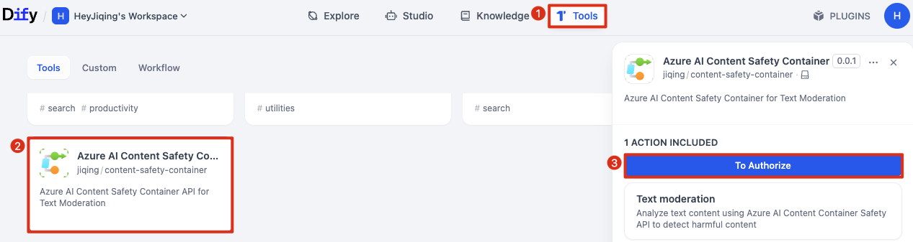
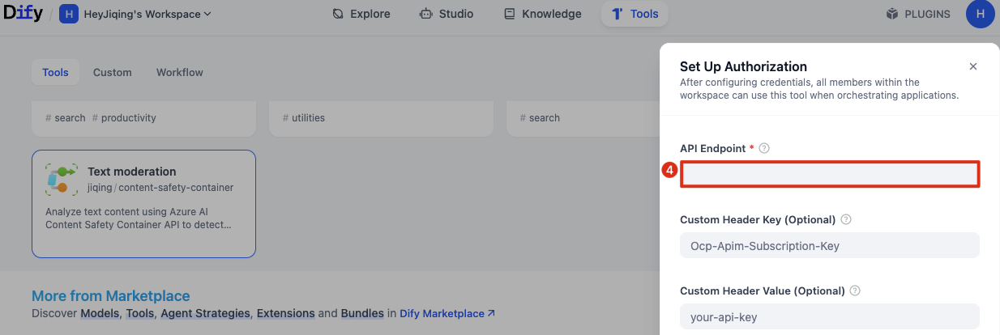
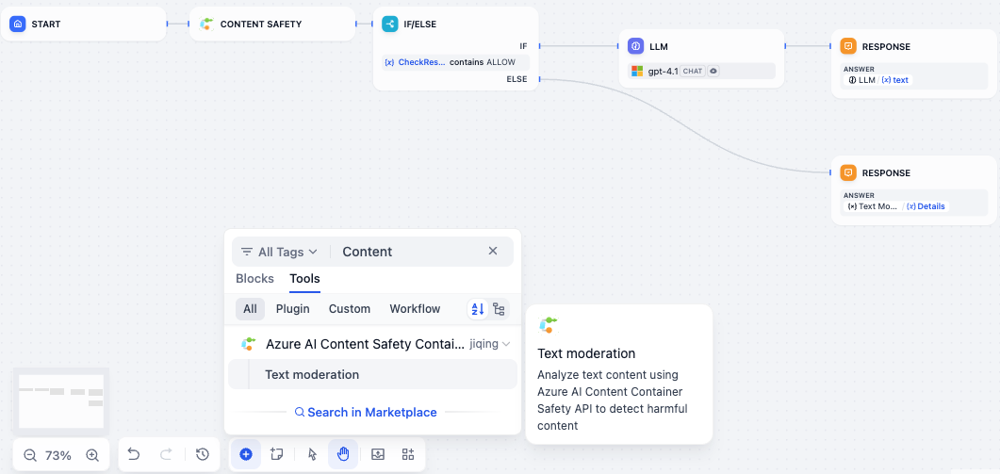

# Azure AI Content Safety Container

> **DISCLAIMER:** This software is provided "as is" and the author disclaims all warranties with regard to this software including all implied warranties of merchantability and fitness. In no event shall the author be liable for any special, direct, indirect, or consequential damages or any damages whatsoever resulting from loss of use, data or profits, whether in an action of contract, negligence or other tortious action, arising out of or in connection with the use or performance of this software.
> 
> **SECURITY:** This plugin processes text and image content through external API calls to Azure AI Content Safety services. Please ensure you comply with your organization's data privacy policies and Azure's terms of service when using this plugin. The plugin author is not responsible for any data privacy or security issues arising from the use of this software.

## Overview

### Azure AI Content Safety

Azure AI Content Safety is an AI service that detects harmful user-generated and AI-generated content in applications and services. Azure AI Content Safety includes text and image APIs that allow you to detect material that is harmful. 

Every harm category the service applies also comes with a severity level rating. The severity level is meant to indicate the severity of the consequences of showing the flagged content.

<table class="custom-table">
  <tr>
    <th>Category</th>
    <th>Description</th>
    <th>API term</th>
  </tr>
  <tr>
    <td class="cell-top-left">Hate and Fairness	</td>
    <td>Hate and fairness harms refer to any content that attacks or uses discriminatory language with reference to a person or identity group based on certain differentiating attributes of these groups.

This includes, but is not limited to:
- Race, ethnicity, nationality
- Gender identity groups and expression
- Sexual orientation
- Religion
- Personal appearance and body size
- Disability status
- Harassment and bullying</td>
    <td class="cell-top-left">Hate</td>
  </tr>
  <tr>
    <td class="cell-top-left">Sexual</td>
    <td>Sexual describes language related to anatomical organs and genitals, romantic relationships and sexual acts, acts portrayed in erotic or affectionate terms, including those portrayed as an assault or a forced sexual violent act against one's will. 

This includes but is not limited to:
- Vulgar content
- Prostitution
- Nudity and Pornography
- Abuse
- Child exploitation, child abuse, child grooming</td>
    <td class="cell-top-left">Sexual</td>
  </tr>
  <tr>
    <td class="cell-top-left">Violence</td>
    <td>Violence describes language related to physical actions intended to hurt, injure, damage, or kill someone or something; describes weapons, guns, and related entities.

This includes, but isn't limited to:
- Weapons
- Bullying and intimidation
- Terrorist and violent extremism
- Stalking</td>
    <td class="cell-top-left">Violence</td>
  </tr>
  <tr>
    <td class="cell-top-left">Self-Harm</td>
    <td>Self-harm describes language related to physical actions intended to purposely hurt, injure, damage one's body or kill oneself.

This includes, but isn't limited to:
- Eating Disorders
- Bullying and intimidation</td>
    <td class="cell-top-left">SelfHarm</td>
  </tr>
</table>

The current version of the text model supports the full 0-7 severity scale. The classifier detects among all severities along this scale. If the user specifies, it can return severities in the trimmed scale of 0, 2, 4, and 6; each two adjacent levels are mapped to a single level.

### Azure AI Content Safety Container
Containers let you use a subset of the Azure AI Content Safety features in your own environment. With content safety containers, you can build a content safety application architecture optimized for both robust cloud capabilities and edge locality. Containers help you meet specific security and data governance requirements.

### Dify Plugin for Azure AI Content Safety Container

This is a Dify plugin that integrates with the [Azure AI Content Safety Container](https://learn.microsoft.com/en-us/azure/ai-services/content-safety/overview) to analyze both text and image content for harmful material. The plugin can detect various types of harmful content including hate speech, violence, sexual content, and self-harm.

### Features

- **Unified Moderation**: Analyze both text and images in a single tool.
- **Custom Configuration**: Support for custom API endpoints and optional authentication headers.
- **Text Blocklists**: Utilize blocklists for more precise text content filtering.
- **Combined Results**: Get a single, structured result summarizing findings from both text and image analysis.
- **Clear Decisions**: Outputs a clear `ALLOW` or `DENY` check result.
- **Detailed & Formatted Output**: Provides formatted violation details.
- **Raw Data Access**: Includes a `RawResults` output variable with the original JSON from the API for advanced use cases.

## Configuration

### Prerequisites

Before using this plugin, make sure you have an Azure AI Content Safety container properly set up and running. See [Install and run content safety containers with Docker](https://learn.microsoft.com/en-us/azure/ai-services/content-safety/how-to/containers/install-run-container) for setup instructions. Please verify that your container is accessible and responding to API requests before configuring this plugin.

### Steps

**1）Get Azure AI Content Safety Container Tools**

The Azure AI Content Safety Container Tools could be installed via Plugin Marketplace/Github/Local Package File, please install it.

**2）Authentication**

On the Dify navigation page, go to Tools > Azure AI Content Safety Container > To Authorize to fill in the API Endpoint, API Version and optional headers.




**3）Using the tool**

You can use this tool in Chatflow or Workflow. The tool accepts both text and image inputs.

- `Text to Analyze`: The text content to analyze.
- `Images to Analyze`: The image files to analyze.
- `Text Blocklist Names`: Comma-separated list of blocklist names for text analysis.
- `Halt on Blocklist Hit`: Whether to stop text analysis if a blocklist item is matched.




## Examples

The plugin provides a detailed, formatted output in the `Details` variable when harmful content is detected.

**1）Example: Combined Text and Image Moderation**

When both text and an image contain harmful content, the results are intelligently combined.

*Input:*
- **Text**: "I hate you, I want to kill you."
- **Image**: An image with sexually suggestive content.

*Output (`Details` variable):*
```markdown
## Harmful Content Detected !

Your input contains harmful information(e.g., **hate and fairness**, **sexual**, **violence**, or **self-harm**), please remove or modify such content and try again!

___

### BlockListsMatched:

`kill`

### CategoriesAnalysis:

- `text` **hate** (SeverityLevel: 6);
- `text` **violence** (SeverityLevel: 7);
- `image` **sexual** (SeverityLevel: 4);

> Text severity: 0–7; Image severity: 0, 2, 4, 6; higher means more severe.
```

## Output Variables

The tool provides several output variables for use in your workflow:

- `CheckResult`: The final decision (`ALLOW`, `DENY`, or `ERROR`).
- `Details`: A user-friendly, formatted string explaining the violations (only present if `CheckResult` is `DENY`).
- `RawResults`: A JSON object containing the raw, unmodified responses from the Azure APIs. This is useful for custom parsing or logging.

*Example `RawResults` structure:*
```json
{
  "text": {
    "blocklistsMatch": [],
    "categoriesAnalysis": [
      {
        "category": "Hate",
        "severity": 6
      }
    ]
  },
  "image": [
    {
      "categoriesAnalysis": [
        {
          "category": "Sexual",
          "severity": 4
        }
      ]
    }
  ]
}
```

## More Details

See [Secure your AI Apps with Azure AI Content Safety Container](https://heyjiqing.notion.site/Secure-your-AI-Apps-with-Azure-AI-Content-Safety-Container-214de7b6e4e88008a072ccb0e6a0f1d6)